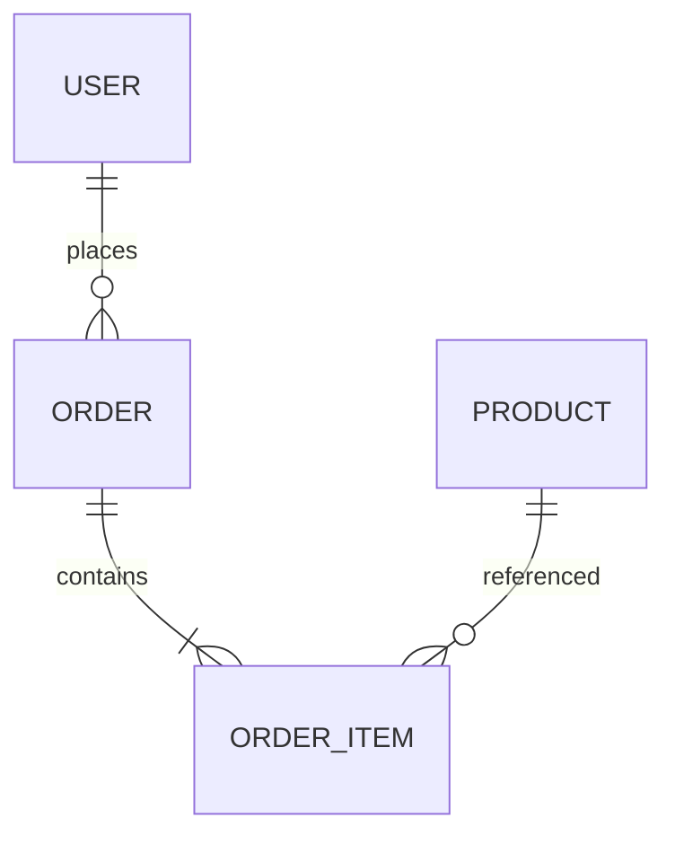

# Database Schema — Architecture (Release {{X}})

> **Sources:** API resources, UI flows, chosen datastore(s) from recommendation report.  
> **Goal:** Model data to satisfy flows with integrity, performance, and privacy.

---

## 0) Datastore Selection & Rationale
- **Primary DB:** {{PostgreSQL / MySQL / MongoDB / Serverless}} (from composition)  
- **Secondary:** {{Search / Cache / Blob}} (if any)  
- **Multi‑tenancy:** {{schema per tenant / column / database}}  

---

## 1) Entity Model (ERD)

> Update ERD to reflect actual entities.

---

## 2) Tables / Collections
> Repeat for each entity.

### `users`
- **Columns:**
  - `user_id UUID PK`
  - `email TEXT UNIQUE NOT NULL`
  - `password_hash TEXT` (if owning auth)  
  - `created_at TIMESTAMP NOT NULL DEFAULT now()`
- **Indexes:** `idx_users_email` (unique), `idx_users_created_at`  
- **PII Class:** `email` = PII‑1  
- **Constraints:** email format validated at API layer  
- **Notes:** soft delete? `deleted_at TIMESTAMP NULL`

### `orders`
- `order_id UUID PK`, `user_id UUID FK -> users.user_id`, `status TEXT`, `total_minor INT`, `currency CHAR(3)`, `created_at`  
- **Indexes:** `(user_id, created_at DESC)`  
- **Enum:** `status ∈ {PENDING, PAID, FAILED, CANCELLED}`  

---

## 3) Data Lifecycle & Privacy
- **Retention:** `orders`: 7 years; `logs`: 30 days  
- **Deletion:** soft delete vs hard delete policy; GDPR requests workflow  
- **Encryption:** at rest (KMS) and in transit (TLS); field‑level if sensitive  
- **Audit:** `audit_log` table for critical events

---

## 4) Migrations & Seeding
- **Tool:** {{Prisma/Flyway/Liquibase/Knex}}  
- **Strategy:** forward‑only, revert plan, pre/post hooks  
- **Seed data:** minimal fixtures for local/dev

---

## 5) Performance
- **Hot queries:** list and plan indexes  
- **Partitioning:** by time/tenant if > N rows/month  
- **Caching:** materialized views / Redis keys (if selected)

---

## 6) Open Questions & Assumptions
- [ ] {{Ambiguity about ownership of auth}}  
- [ ] {{PII classification pending from compliance}}
