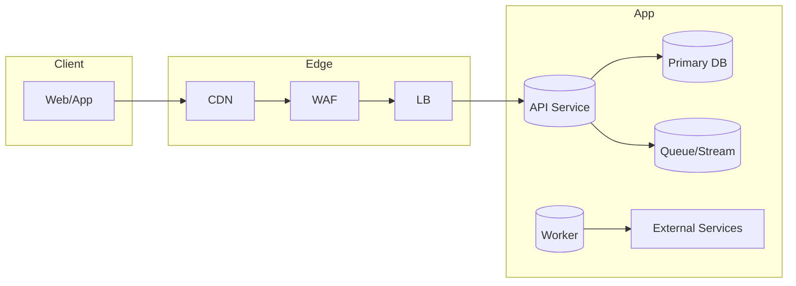

# Infrastructure Plan — Architecture (Release {{X}})

> **Sources:** Recommendation report (selected deploy targets), prototyping composition, and system NFRs.  
> **Goal:** Define environments, deployment, IaC, networking, observability, security, and DR — minimal yet production‑grade.

---

## 0) High‑Level Diagram

> Update based on chosen stack (serverless, containers, PaaS).

---

## 1) Environments
- **Dev** (ephemeral? feature branches)  
- **Staging** (prod‑like)  
- **Prod** (multi‑AZ/region if required)  
- **Config strategy:** Twelve‑Factor; config via env/SSM; no secrets in code

---

## 2) IaC & CI/CD
- **IaC Tool:** {{Terraform/Pulumi/CloudFormation}}; remote state & locking  
- **Pipelines:** build → test → scan → deploy (canary/blue‑green)  
- **Artifacts:** container registry or serverless bundles  
- **Migration step:** run DB migrations gated by health checks

---

## 3) Networking & Security
- **Network:** VPC, private subnets, NAT egress, SGs/NSGs  
- **Edge:** CDN, WAF, TLS (ACME automation)  
- **Identity:** IAM least privilege; roles per service  
- **Secrets:** {{Vault/SSM/KMS}}; rotation policy  
- **Compliance:** OWASP ASVS, CSP/STS, secure headers

---

## 4) Observability & Reliability
- **Metrics:** RED/USE metrics for API & integrations  
- **Logs:** structured, PII‑redacted, centralized, retention policy  
- **Traces:** distributed tracing with service labels  
- **SLOs:** e.g., Availability 99.9%, p95 latency < 300ms; **Error Budget Policy:** burn alerts  
- **On‑call:** alert routing, runbooks, incident templates

---

## 5) Data Management & DR
- **Backups:** schedule, encryption, retention, restore drills  
- **RPO/RTO:** {{e.g., RPO 15m, RTO 1h}}  
- **Multi‑AZ/Region:** criteria & plan  
- **Data residency:** constraints (if any)

---

## 6) Cost & Capacity
- **Autoscaling:** targets & floors/ceilings  
- **Cost guardrails:** budgets & anomaly alerts  
- **Right‑sizing:** instance classes / serverless concurrency

---

## 7) Open Questions & Assumptions
- [ ] {{Choice of serverless vs containers}}  
- [ ] {{Regional requirements from stakeholders}}
