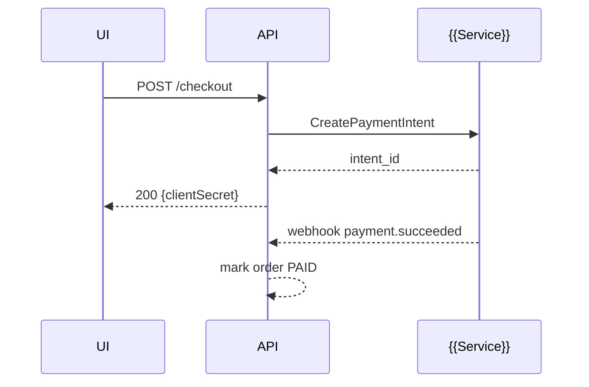

# Service Integration — Architecture (Release {{X}})

> **Sources:** `apis.yaml`, `services.yaml`, recommendation report (selected vendors), and UI flows.  
> **Goal:** Define reliable, observable, and cost‑aware integrations with external APIs/services.

---

## 0) Selected Services (from composition)
| Service | Capability | Mode (SDK/REST/Webhook) | Environments | Quotas | Notes |
|--------|------------|--------------------------|--------------|--------|------|
| {{Stripe}} | payments | SDK + Webhooks | test, prod | {{…}} | {{…}} |

---

## 1) Integration Specs (repeat per service)

### {{Service Name}} — `INT-01`
**Use cases:** {{payments, auth, search}} (link flows/pages)  
**Auth & Scopes:** {{OAuth2, API keys, HMAC}}  
**Endpoints / SDK modules:** {{list}}  
**Request policy:** timeouts {{3s}}, retries {{3}} (expo backoff, jitter), idempotency keys {{header}}  
**Circuit breaker:** open after {{5}} failures / {{30s}} half‑open  
**Rate limiting:** client‑side limiter {{tokens/sec}}, respect `429` with `Retry-After`  
**Caching:** {{memoize|get|ttl}} where applicable  
**Webhooks:** endpoints, signature verification, replay protection, idempotent handlers  
**Data mapping:**

| External Field | Internal Field | Transform | PII Class | Notes |
|----------------|----------------|----------|----------|------|
| `amount` | `total_minor` | identity | PII‑0 | - |

**Sequence Diagram (Mermaid):**

**Observability:** logs (PII redaction), metrics (success rate, latency, retries), traces (span attributes for external calls)  
**Testing:** sandbox keys, mock server, contract tests, replay fixtures  
**Failure modes & fallback:** {{graceful degradation path}}  
**Secrets management:** location (e.g., SSM/Vault), rotation policy  
**Compliance:** data residency, PCI/PHI restrictions

---

## 2) Global Integration Policies
- Standard timeouts, retries, circuit breakers, and idempotency rules.  
- Backoff strategy with jitter; detect transient vs permanent errors.  
- Webhook delivery verification & replay protection.  
- Dependency health dashboard and alerts.

---

## 3) Open Questions & Assumptions
- [ ] {{Question with link to epic or vendor doc}}
